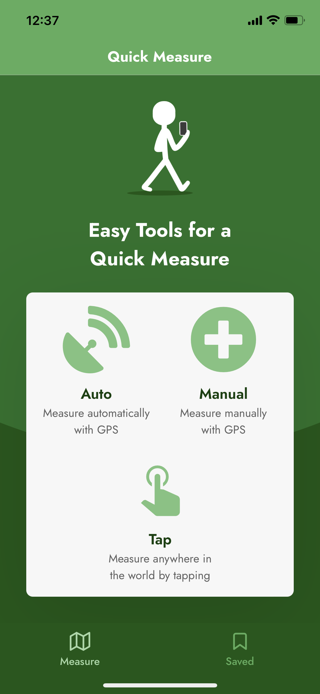
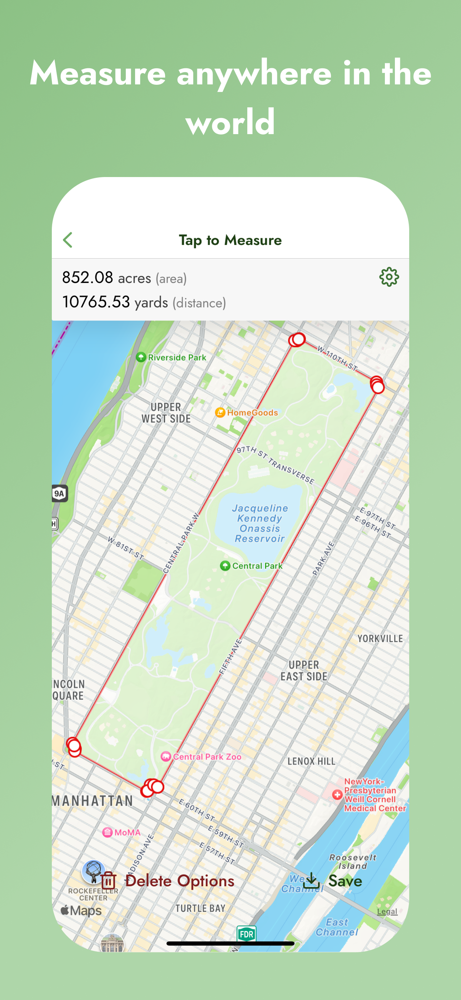
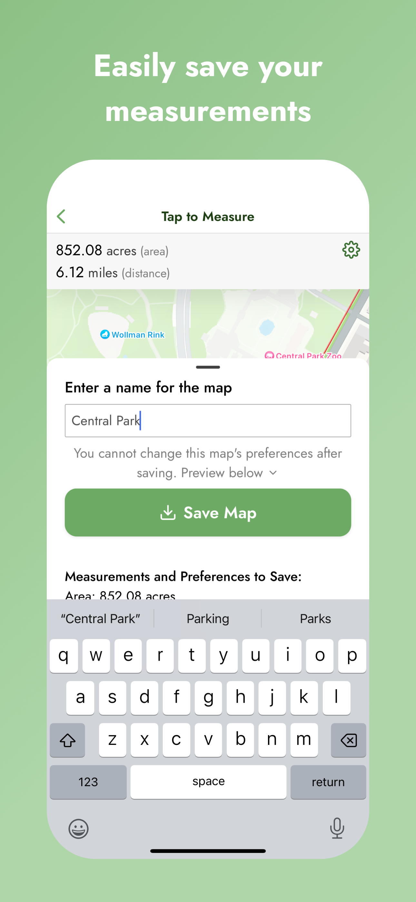
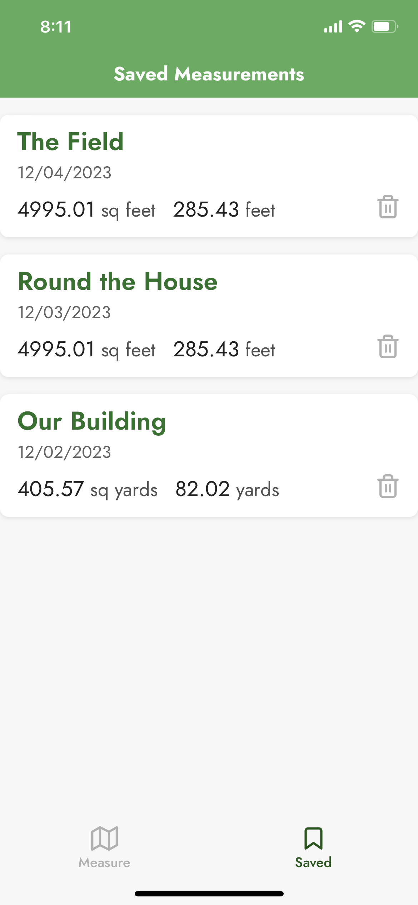

# Quick Measure

Quick Measure is a quick and simple tool to find GPS measurements. Use your GPS position to measure distance and area. The primary goal is quickness: it only takes two taps and feet to start measuring with your location!

## Who is it For?

I created this app for my dad, a farmer. Traditional distance and area measurement tools involve clicking on a satellite map to add markers. My dad needed to find measurements for fields that change annually and undefined sections of land. He should not have to guess where to measure when he's back at the computer.

Quick Measure is for anyone who needs to find distance or area! Farmers, landscapers, homeowners, hunters, runners, and dog walkers are only a few examples.  

Quick Measure is built with React Native, which is a cross-platform language. However, Quick Measure is currently only available for iOS devices.

* Quick Measure should never be used for official or legal measurements. Contact a Professional Land Surveyor when an official measurement is required.
* Quick Measure should never be used while operating machinery.
* Quick Measure should never be used as a turn-based navigation app.

  
  
  
  
  

## Features

### Auto Measure

Automatically track your path with your phone's GPS as you walk or run around the space you want to measure. You can "Start Measuring," "Pause Measuring," and "Resume Measuring."

### Manual Measure

Manually add markers to your path with your phone's GPS. Use "Manual Measure" to create straight line or when you cannot walk the line you wish to measure.

### Tap to Measure

Tap on the map to add markers with this traditional measurement tool.

### Save Measurements

Save a measurement from any tool to view later in the "Saved" tab. Saved measurements display a quick view with the measurement's name, creation date, distance, and area. Click on the measurement to view the map.

### Measurement Display

Display distance and area or only distance on the map. Ideal for runners, dog walkers, or anyone only requiring distance.

### Units of Measurement

Units of measurement available: `feet`, `yards`, `miles`, `acres`, `meters`, and `kilometers`.

## Usage
  1. Choose a measurement tool (`Auto`, `Manual`, `Tap`)
  2. `Start Measuring` in `Auto Measure` or start adding markers in `Manual Measure` or `Tap to Measure`
  3. Adjust display and measurement settings with the `Gear Icon` in the upper right of the screen
  4. Make changes with `Delete Options` to either select markers to delete or delete all markers
  5. Save your measurement with `Save` to open the `Save Menu`. Then name your map and press `Save Map`
  6. View your saved measurement by returning to the `Home Screen` and navigating to the `Saved` tab
  7. Click on a saved measurement to view the map, or delete the measurement with the `Trash Icon` icon

  * Measurements in all tools persist until they are deleted by the user. 

## Tech Stack

### React Native

### [Nativewind(Tailwind CSS)/OOCSS](https://www.nativewind.dev/)
  - enables Tailwind CSS in React Native

### [react-native-maps](https://github.com/react-native-maps/react-native-maps)
  - app is built on react-native-maps to display measurements with Apple Maps

### [Expo](https://expo.dev/)

### [expo-router](https://docs.expo.dev/router/introduction/)
  - filed-based router for React Native

### [react-native-bottom-sheet](https://gorhom.github.io/react-native-bottom-sheet/)

### [geolib](https://www.npmjs.com/package/geolib)

## Contact

For issues, please create an issue on the [project repo](https://github.com/a-down/quick-measure-gps-app/issues).

For questions or conversations, reach out on [LinkedIn](https://linkedin.com/in/alec-downing/).